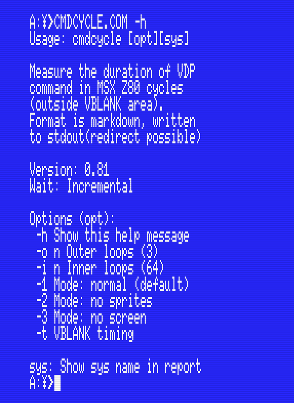

# cmdcycles (cmdcycle.com) | Measure V9938/V9958 commands in MSX Z80 cycles

## What it does

This tool is making a bunch of VDP commands and tries to measure the time the operation takes. From [earlier research](https://openmsx.org/vdp-vram-timing/vdp-timing.html) we know that screen off/on, sprites on/off affects the timings, so we measure separately under these conditions. Measurement is done in the active area only. We also know that some VDPs (systems) [add extra cycles](https://www.msx.org/forum/msx-talk/development/extra-vdp-wait-cycles?page=0) on VDP I/O, so that is catered for as well.

You want to redirect the output to a file, the size will be between 25kB-40kB.

_I should probably explain more about how this tool works! It's coming._

__Note: This is a slow tool. One run (only) will give you this output on an NTSC:__

```
Duration test:  14 minutes 31 seconds  
Duration print: 4 minutes 15 seconds  
```

## Help text



## Understanding the results

We should certainly explain here.

## Requirements

* **Run:** MSX2 or higher, MSX-DOS
* **Build:** SDCC v4.2 or higher (tested with v4.5.24)

## Attributions

* This code includes code snippet by Grauw (see vdpwait.s)

## License

https://creativecommons.org/licenses/by-sa/4.0/