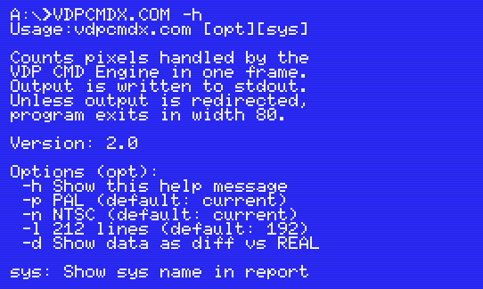

# cmdcycles | Measure V9938/V9958 commands in MSX Z80 cycles

## What it does

ignoring PAL/NTSC, 192/212, VBLANK/DISPLAY.

## Help text

## Understanding the results

## Detail section

## Requirements
* **Run:** MSX2 or higher, MSX-DOS
* **Build:** SDCC v4.2 or higher (tested with v4.6)